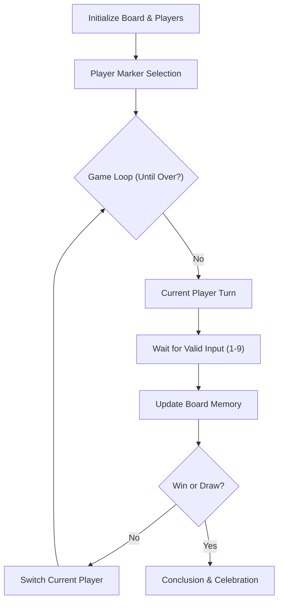

# Technical Specification: Tic Tac Toe in Ruby

## Architectural Overview

**Tic Tac Toe in Ruby** is a structured, modular console application designed to demonstrate clean object-oriented programming (OOP) principles within the Ruby ecosystem. The project serves as a practical implementation of fundamental software engineering concepts, including state management, modular design, and robust user input handling in a terminal environment.

### Game Logic Flow

---

## Technical Implementations

### 1. Core Ruby Engine
-   **Runtime Environment**: Optimized for **Ruby 3.x**, utilizing the standard library for robust computational and game logic.
-   **Modular Design**: Implements a highly organized source code architecture where logic is separated into specialized classes for display, board state, and player interaction.

### 2. Specialized Modules & Components
-   **Board Management**: Handles the 3x3 grid state, utilizing an array-based data structure to track markers and validate winning combinations.
-   **Game Orchestration**: Manages the main game loop, player synchronization, and high-level execution flow.
-   **Display Interface**: A dedicated module for terminal-based UI rendering, ensuring a clean separation between game logic and user presentation.

### 3. Engineering Quality
-   **Software Design Patterns**: Implements core OOP principles including encapsulation, module-based composition, and single responsibility for scalable software architecture.
-   **Linguistic Processing**: Features robust input sanitization and regex-based validation to ensure reliable terminal interaction.

---

## Technical Prerequisites

-   **Runtime**: Ruby 3.0 or higher ([Ruby-lang.org](https://www.ruby-lang.org/)).
-   **Testing Framework**: RSpec for unit testing and code verification.
-   **Development**: RubyMine, VS Code (with Ruby LSP), or any professional IDE.
-   **Linting**: RuboCop for adherence to the Ruby Style Guide.

---

*Technical Specification | TicTacToe Ruby Project | Version 1.0*
